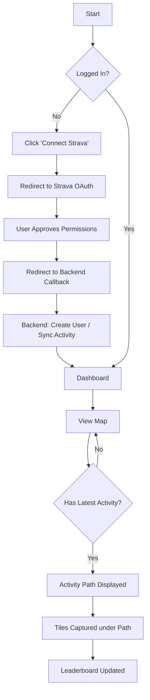
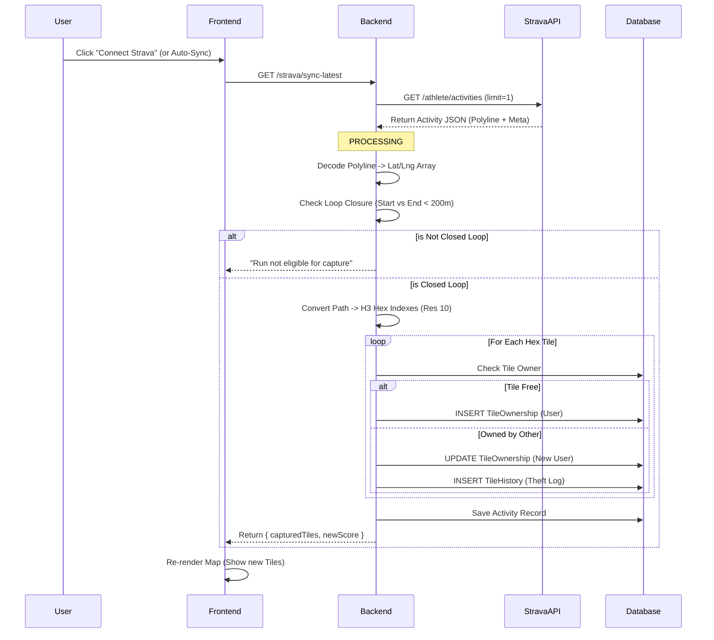

# Ruwalk - Project Documentation

## 1. 🏗️ Tech Stack & Architecture

### Backend (`/backend`)

| Technology           | Usage               | Justification                                                                                                                                                        |
| :------------------- | :------------------ | :------------------------------------------------------------------------------------------------------------------------------------------------------------------- |
| **Node.js (ESM)**    | Runtime Environment | Non-blocking I/O is ideal for handling concurrent API requests and real-time data processing for map tiles.                                                          |
| **Express.js v5**    | Web Framework       | Minimalist and flexible standard for building REST APIs in Node.js.                                                                                                  |
| **PostgreSQL**       | Database            | Robust relational database. Essential for handling complex relationships like `User <-> Activity` and `User <-> TileOwnership`.                                      |
| **Prisma ORM**       | Database Access     | Type-safe database queries. Simplifies schema management and migrations.                                                                                             |
| **H3-js**            | Spatial Indexing    | **Critical Core Tech.** Uber's Hexagonal Hierarchical Spatial Index. Used to discretize the world into unique hexagonal tiles (Resolution 10) for territory capture. |
| **@mapbox/polyline** | Data Processing     | Decodes the compressed "polyline" string from Strava APIs into raw Lat/Lng coordinates.                                                                              |
| **@turf/turf**       | Geospatial Math     | Calculates heavy geospatial logic like distance between coordinates and checking if a point is inside a polygon.                                                     |
| **Axios**            | HTTP Client         | Used for server-to-server communication with the Strava API.                                                                                                         |

### Frontend (`/frontend`)

| Technology          | Usage         | Justification                                                                                                                                               |
| :------------------ | :------------ | :---------------------------------------------------------------------------------------------------------------------------------------------------------- |
| **React v19**       | UI Library    | Component-based UI development. Allows for complex state management (Maps, Auth, Data) in a clean way.                                                      |
| **Vite**            | Build Tooling | Extremely fast development server and bundler.                                                                                                              |
| **Tailwind CSS v4** | Styling       | Utility-first CSS. Enables rapid UI development and consistent design tokens.                                                                               |
| **MapLibre GL JS**  | Map Rendering | Open-source alternative to Mapbox. Renders vector tiles (via MapTiler) and handles complex GeoJSON layers (Thousands of hex tiles) efficiently using WebGL. |
| **React Router**    | Navigation    | Client-side routing for the Single Page Application (SPA).                                                                                                  |

---

## 2. 🔌 API Endpoints Reference

### Authentication (Strava)

- **`GET /strava/login`**: Initiates the OAuth2 flow. Redirects user to Strava's consent page.
- **`GET /strava/callback`**: The callback URL Strava redirects to. Exchanges the temporary authorization code for an Access Token, creates/updates the User in the DB, and auto-syncs their latest activity.

### Core Gameplay

- **`GET /strava/sync-latest?token=...`**:
  - **Functionality**: Manually triggers a sync of the user's latest Strava activity.
  - **Logic**:
    1. Fetch latest activity from Strava.
    2. Check if it's a "Closed Loop" (Start/End within 200m).
    3. If closed, calculate all H3 tiles along the path.
    4. Upsert ownership records in DB (Steal tile if owned by others).
    5. Return new tiles and stats.
- **`GET /leaderboard`**:
  - **Functionality**: Returns top 50 users ranked by **Tiles Owned** (primary) and **Distance** (secondary).

### User & Map Data

- **`GET /me/tiles`**: Returns the list of all tile IDs owned by the authenticated user. Used to paint the map "Blue" (or own color).
- **`GET /me/routes`**: Returns the user's activity history (polylines) to visualize paths on the map.
- **`GET /users/:id/tiles`**: Fetches tile data for a specific user (for viewing others' profiles).

---

## 3. 🔄 Application Flows

### High-Level User Flow

### Technical Data Flow: "The Sync Process"

This is the core logic of the application, turning a physical run into a digital territory.

## 4. 🧠 Key Implementation Details

- **H3 Spatial Indexing**: We use Resolution 10 (~66m edge). This is the "Goldilocks" zone for walking games—small enough to require actual movement to cover, but large enough to cover a neighborhood block meaningfully.
- **Optimistic UI vs Truth**: The frontend relies on the backend for the "Truth". The map doesn't calculate tiles clientside; it strictly renders the list of `tileIds` the backend says the user owns. This prevents cheating.
- **Map Layering**:
  - **Layer 1 (Bottom)**: Standard Street Map (MapTiler).
  - **Layer 2**: "History" Tiles (Faded gray, owned by others or past history).
  - **Layer 3**: "Current" Tiles (User's Territory - Painted Color).
  - **Layer 4**: Route Path (Glowing Line).
  - **Layer 5 (Top)**: Labels & POIs.
