# Ruwalk Prototype - Detailed Technical Explanation

## 🎯 What is the Prototype?

The prototype is a **frontend-only** version of Ruwalk that demonstrates the UI and map features without requiring a backend server, database, or Strava API. It's a "static demo" with hardcoded data that looks and behaves like the real app.

## 🏗️ Architecture Comparison

### Main App Flow

```
User Login → Strava OAuth → Backend API → PostgreSQL Database → Fetch Activities → Calculate Tiles → Render Map
```

### Prototype Flow

```
Page Load → Hardcoded Data → Render Map
```

**Key Difference**: The prototype skips all the backend complexity and uses JavaScript objects instead of API calls.

---

## 📂 Component Breakdown

### 1. **App.jsx** - The Main Controller

This is the heart of the prototype. Instead of fetching data from APIs, it defines everything locally:

#### Hardcoded User Data

```javascript
const currentUser = {
  id: "1",
  firstname: "Niranjan",
  lastname: "Shirke",
  username: "niranjan_run",
  profile: null, // No avatar image
};
```

**In Real App**: This comes from `/strava/callback` after OAuth login.

#### Hardcoded Territory Tiles

```javascript
const currentTiles = [
  "8a2db4a4c927fff", // H3 hexagon ID
  "8a2db4a4c92ffff",
  // ... 10 tiles total
];
```

**What are these strings?**

- These are **H3 spatial indexes** - unique IDs for hexagonal tiles on Earth
- Each represents a ~66m hexagon somewhere in Pune
- In the real app, these come from the database based on which tiles the user captured

**In Real App**: Fetched from `GET /me/tiles` which queries the `TileOwnership` table.

#### Hardcoded Routes (Activities)

```javascript
const routes = [
  {
    activityId: 1,
    name: "Morning Run - Koregaon Park",
    distance: 5200, // meters
    date: new Date("2026-01-28"),
    polyline: "ypqlCwxquMaBkAqBmA...", // Encoded GPS path
  },
];
```

**What is a polyline?**

- A compressed string encoding a GPS path (list of lat/lng coordinates)
- Format invented by Google, used by Strava
- Example: `"ypqlC..."` decodes to `[[18.5204, 73.8567], [18.5205, 73.8568], ...]`

**In Real App**: Fetched from `GET /me/routes` which returns activities from the database.

---

### 2. **TerritoryMap.jsx** - The Map Engine

This component is **nearly identical** to the main app's version. It handles:

#### Map Initialization

```javascript
const map = new maplibregl.Map({
  container: containerRef.current,
  style: `https://api.maptiler.com/maps/streets/style.json?key=${key}`,
  center: [73.8567, 18.5204], // Pune coordinates
  zoom: 11,
});
```

**What happens here:**

1. Creates a MapLibre GL instance (open-source map renderer)
2. Loads base map tiles from MapTiler (street map imagery)
3. Centers on Pune, India

#### Converting H3 Tiles to Map Polygons

```javascript
function h3TilesToGeoJSON(tileIds) {
  const features = tileIds.map((tileId) => {
    const boundary = cellToBoundary(tileId, true); // Get hexagon corners
    boundary.push(boundary[0]); // Close the polygon
    return {
      type: "Feature",
      geometry: { type: "Polygon", coordinates: [boundary] },
    };
  });
  return { type: "FeatureCollection", features };
}
```

**Step-by-step:**

1. Take H3 ID like `"8a2db4a4c927fff"`
2. Use `h3-js` library to get the 6 corner coordinates
3. Convert to GeoJSON format (standard for map data)
4. Return a "FeatureCollection" that MapLibre can render

#### Decoding Route Polylines

```javascript
const decoded = polyline
  .decode(r.polyline) // "ypqlC..." → [[lat,lng], [lat,lng], ...]
  .map(([lat, lng]) => [lng, lat]); // Swap to [lng,lat] for MapLibre
```

**Why the swap?**

- Polyline format: `[latitude, longitude]`
- MapLibre format: `[longitude, latitude]`
- This is a common GIS gotcha!

#### Map Layers (Bottom to Top)

```javascript
1. Base Map (Streets from MapTiler)
2. History Tiles (Gray, faded)
3. Current Tiles (Dark, prominent)
4. Route Glow (White outline)
5. Route Core (Red line)
```

Each layer is added using `map.addLayer()` with specific styling.

#### Interactive Popups

```javascript
map.on("click", "route-glow", (e) => {
  const props = e.features[0].properties; // Get route data
  new maplibregl.Popup()
    .setLngLat(coordinates)
    .setHTML(`<h3>${props.name}</h3>...`)
    .addTo(map);
});
```

**What happens:**

1. User clicks on a route line
2. MapLibre detects the click on the "route-glow" layer
3. Extracts route properties (name, distance, date)
4. Creates a popup with formatted HTML
5. Displays it at the click location

---

### 3. **Leaderboard.jsx** - Static Rankings

```javascript
const leaderboardData = [
  {
    firstname: "Niranjan",
    tiles: 245,
    totalKm: 42.5,
  },
  // ... more users
];
```

**In Real App**: This comes from `GET /leaderboard` which:

1. Queries all users
2. Counts their tiles from `TileOwnership`
3. Sums their distances from `Activity`
4. Sorts by tiles (primary) and distance (secondary)

**In Prototype**: Just renders the hardcoded array.

---

## 🔄 Data Flow Diagram

```mermaid
graph TD
    A[User Opens Prototype] --> B[App.jsx Loads]
    B --> C[Hardcoded Data Defined]
    C --> D[Pass to TerritoryMap Component]
    D --> E[MapLibre Initializes]
    E --> F[Convert H3 IDs to Polygons]
    F --> G[Decode Polylines to Coordinates]
    G --> H[Render Layers on Map]
    H --> I[User Interacts with Map]
    I --> J[Click Route → Show Popup]
```



---

## 🆚 Main App vs Prototype

| Feature              | Main App                  | Prototype           |
| -------------------- | ------------------------- | ------------------- |
| **Authentication**   | Strava OAuth              | None (fake user)    |
| **Data Source**      | PostgreSQL Database       | JavaScript objects  |
| **Tiles**            | Calculated from GPS paths | Hardcoded H3 IDs    |
| **Routes**           | Fetched from Strava API   | Hardcoded polylines |
| **Leaderboard**      | Real-time from DB         | Static list         |
| **Updates**          | Syncs on new activities   | Never changes       |
| **Backend Required** | Yes (Express + Prisma)    | No                  |

---

## 🎨 How to Customize the Prototype

### Change the Map Location

Edit `TerritoryMap.jsx`:

```javascript
center: [73.8567, 18.5204],  // [longitude, latitude]
zoom: 11,
```

### Add More Tiles

Edit `App.jsx`:

```javascript
const currentTiles = [
  "8a2db4a4c927fff",
  "YOUR_NEW_H3_ID_HERE", // Get from h3.uber.com
];
```

**How to get H3 IDs:**

1. Go to https://h3geo.org/
2. Click on the map
3. Copy the Resolution 10 ID

### Add a New Route

Edit `App.jsx`:

```javascript
const routes = [
  {
    name: "Your Route Name",
    distance: 3000, // meters
    date: new Date("2026-01-30"),
    polyline: "YOUR_ENCODED_POLYLINE", // From Strava or encode manually
  },
];
```

**How to get a polyline:**

- Export a GPX file from Strava
- Use an online encoder: https://developers.google.com/maps/documentation/utilities/polylineutility

---

## 🚀 Running the Prototype

```bash
cd d:\ruwalk\prototype
npm run dev
```

**What happens:**

1. Vite starts a dev server
2. Compiles React components
3. Processes Tailwind CSS
4. Serves at http://localhost:5174/
5. Hot-reloads on file changes

---

## 🔧 Dependencies Explained

| Package              | Purpose                       |
| -------------------- | ----------------------------- |
| **react**            | UI framework                  |
| **maplibre-gl**      | Map rendering engine          |
| **h3-js**            | Convert H3 IDs to coordinates |
| **@mapbox/polyline** | Decode GPS paths              |
| **tailwindcss**      | Styling                       |
| **vite**             | Build tool                    |

---

## ⚠️ Limitations

1. **No Real Data**: Everything is static
2. **No Persistence**: Refresh = reset
3. **No Backend**: Can't sync new activities
4. **No Authentication**: Anyone can view
5. **Fixed Tiles**: Can't capture new territory

---

## 💡 Use Cases

✅ **Good For:**

- Demos and presentations
- UI/UX testing
- Showing to stakeholders without setup
- Frontend development without backend

❌ **Not Good For:**

- Real user testing
- Performance testing with large datasets
- Testing backend logic
- Production deployment

---

## 🎓 Key Concepts Explained

### H3 Spatial Index

- Uber's system for dividing Earth into hexagons
- Resolution 10 = ~66m edge length
- Each hex has a unique ID like `"8a2db4a4c927fff"`
- Used for efficient territory ownership tracking

### Polyline Encoding

- Compresses GPS paths into short strings
- `[[18.52, 73.85], [18.53, 73.86]]` → `"ypqlCwxquM..."`
- Saves bandwidth when transmitting routes
- Standard format used by Google Maps and Strava

### GeoJSON

- Standard format for geographic data
- Used by all modern mapping libraries
- Structure: `{ type: "FeatureCollection", features: [...] }`

### MapLibre GL

- Open-source map renderer
- Uses WebGL for smooth performance
- Can handle thousands of polygons
- Alternative to Mapbox GL (which became paid)

---

## 🔗 Next Steps

To convert the prototype into a real app:

1. Add backend API calls instead of hardcoded data
2. Implement authentication
3. Connect to database
4. Add Strava integration
5. Implement tile calculation logic

**But you already have that!** → The main app in `d:\ruwalk` 😊
